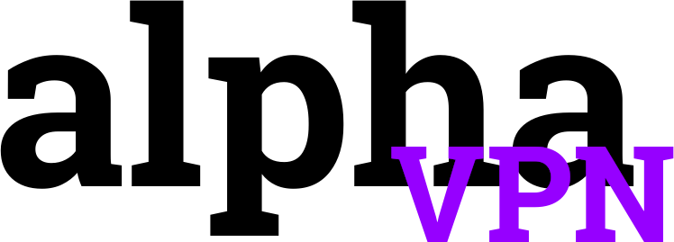

alphaVPN
========

## Build

Firstly you will need a working internet connection to build alpha, this is due to the fact
that the tunneling code needs to be fetched from a remote repository. If you are online
then you may proceed to build alpha with the following command:

```bash
make
```

### Dependencies

1. `jansson-devel`

## Usage

Once you have built the daemon you can then run it using:

```bash
alphad --help
```

The above will list all available commands
